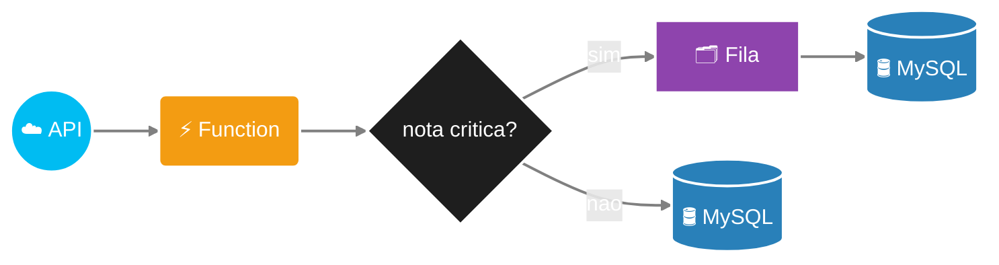

# Fluxo Function Feedback (API)

```mermaid
graph LR
    API((☁️ API))
    Func(⚡ Function)
    Condicao{nota critica?}
    Tabela[🗂️ Fila]
    DB_Sim[(🛢️ MySQL)]
    DB_Nao[(🛢️ MySQL)]

    API --> Func
    Func --> Condicao
    Condicao -- "sim" --> Tabela
    Tabela --> DB_Sim
    Condicao -- "nao" --> DB_Nao

    %% Definição das classes de estilo usando "white" para evitar erros de parser
    classDef apiStyle fill:#00bcf2,stroke:white,stroke-width:2px,color:white;
    classDef funcStyle fill:#f39c12,stroke:white,stroke-width:2px,color:white;
    classDef condStyle fill:#1e1e1e,stroke:white,stroke-width:2px,color:white;
    classDef tabStyle fill:#8e44ad,stroke:white,stroke-width:2px,color:white;
    classDef dbStyle fill:#2980b9,stroke:white,stroke-width:2px,color:white;

    %% Aplicação das classes aos nós
    class API apiStyle;
    class Func funcStyle;
    class Condicao condStyle;
    class Tabela tabStyle;
    class DB_Sim,DB_Nao dbStyle;
    
    %% Estilo das setas
    linkStyle default stroke:gray,stroke-width:2px,color:white;
```
